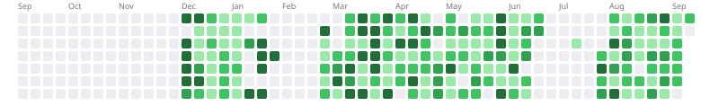

<samp>

- 406 problems solved &mdash; 193 Easy &middot; 167 Medium &middot; 46 Hard
- Current streak: 38 days (longest: 38 days) &middot; 161 active days total

</samp>

### <samp> heatmap.<samp>



### <samp> tags. <samp>

<samp>

<!--START_SECTION:tags-->

```txt
Array                261 problems   ███████▓░░░░░░░░░░░░░░░░░   31.87 %
String               101 problems   ███░░░░░░░░░░░░░░░░░░░░░░   12.33 %
Hash Table           87 problems    ██▓░░░░░░░░░░░░░░░░░░░░░░   10.62 %
Math                 75 problems    ██░░░░░░░░░░░░░░░░░░░░░░░   09.16 %
Dynamic Programming  72 problems    ██░░░░░░░░░░░░░░░░░░░░░░░   08.79 %
Sorting              59 problems    █▓░░░░░░░░░░░░░░░░░░░░░░░   07.20 %
Two Pointers         49 problems    █░░░░░░░░░░░░░░░░░░░░░░░░   05.98 %
Matrix               42 problems    █░░░░░░░░░░░░░░░░░░░░░░░░   05.13 %
Greedy               40 problems    █░░░░░░░░░░░░░░░░░░░░░░░░   04.88 %
Binary Search        33 problems    █░░░░░░░░░░░░░░░░░░░░░░░░   04.03 %
```

<!--END_SECTION:tags-->

</samp>

> [!NOTE]
> Auto-generated by [`.leetcode-sync/sync.py`](.leetcode-sync/sync.py) from my live LeetCode profile &mdash; do not edit by hand

<samp><sub>Last updated: 2026-08-30 04:27</sub></samp>
