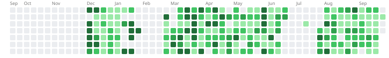

<samp>

- 439 problems solved &mdash; 202 Easy &middot; 183 Medium &middot; 54 Hard
- Current streak: 38 days (longest: 38 days) &middot; 190 active days total

</samp>

### <samp> heatmap.<samp>



### <samp> tags. <samp>

<samp>

<!--START_SECTION:tags-->

```txt
Array                278 problems   ███████▓░░░░░░░░░░░░░░░░░   31.38 %
String               111 problems   ███░░░░░░░░░░░░░░░░░░░░░░   12.53 %
Hash Table           94 problems    ██▓░░░░░░░░░░░░░░░░░░░░░░   10.61 %
Math                 85 problems    ██░░░░░░░░░░░░░░░░░░░░░░░   09.59 %
Dynamic Programming  80 problems    ██░░░░░░░░░░░░░░░░░░░░░░░   09.03 %
Sorting              62 problems    █▓░░░░░░░░░░░░░░░░░░░░░░░   07.00 %
Two Pointers         51 problems    █░░░░░░░░░░░░░░░░░░░░░░░░   05.76 %
Matrix               46 problems    █░░░░░░░░░░░░░░░░░░░░░░░░   05.19 %
Greedy               43 problems    █░░░░░░░░░░░░░░░░░░░░░░░░   04.85 %
Binary Search        36 problems    █░░░░░░░░░░░░░░░░░░░░░░░░   04.06 %
```

<!--END_SECTION:tags-->

</samp>

> [!NOTE]
> Auto-generated by [`.leetcode-sync/sync.py`](.leetcode-sync/sync.py) from my live LeetCode profile &mdash; do not edit by hand

<samp><sub>Last updated: 2026-10-01 11:00</sub></samp>
